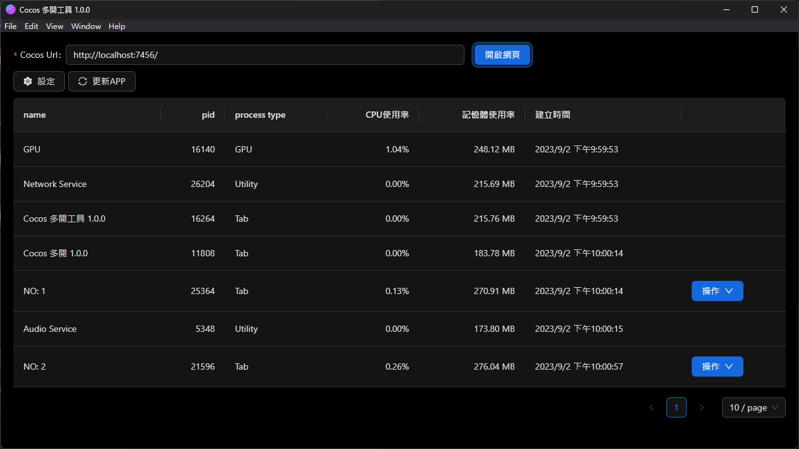
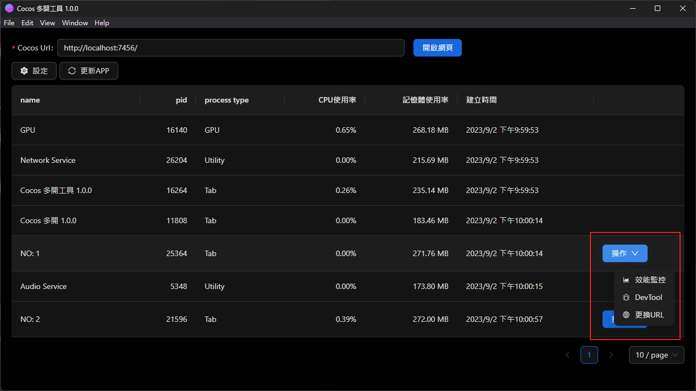
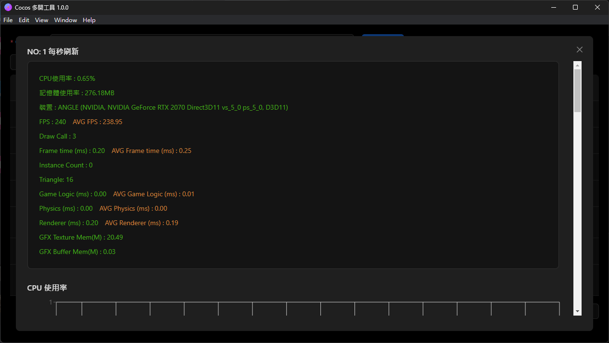
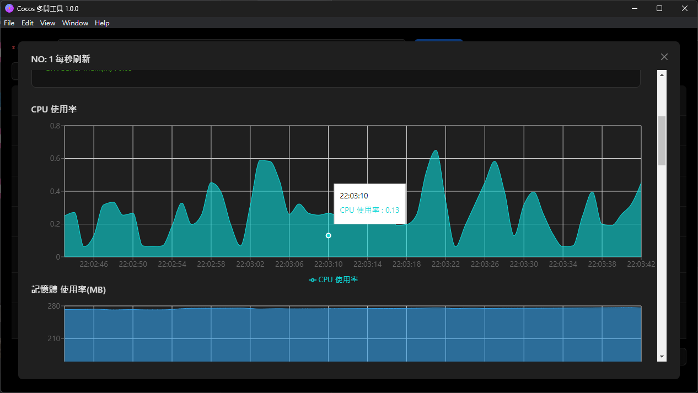
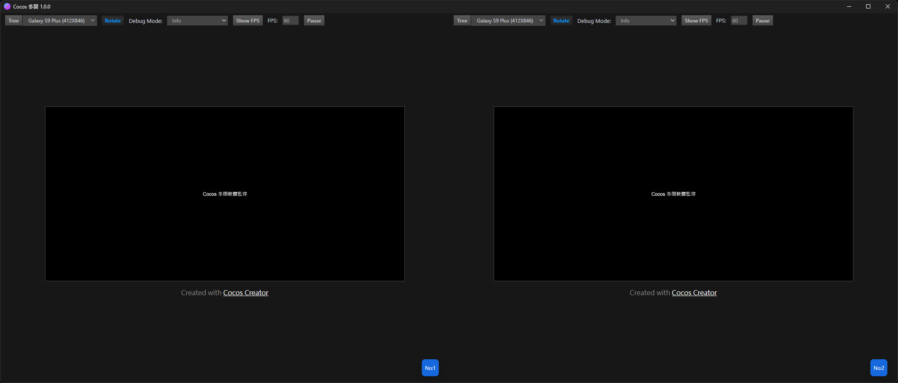

# Cocos 3.X 多開Webview監控軟體

## 監控內容
1. CPU使用率
2. 記憶體使用率
3. FPS 
4. Draw Call 
5. Frame time (ms)
6. Instance Count 
7. Triangle 
8. Game Logic (ms)
9. Physics (ms)
10. Renderer (ms)  
11. GFX Texture Mem(M)  
12. GFX Buffer Mem(M)

## 截圖

